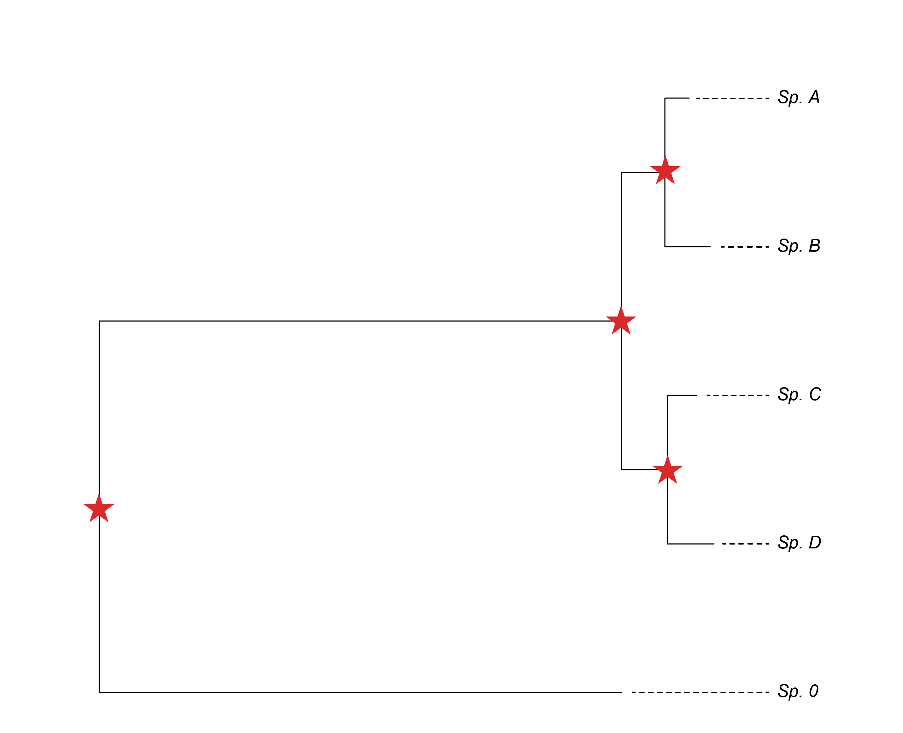
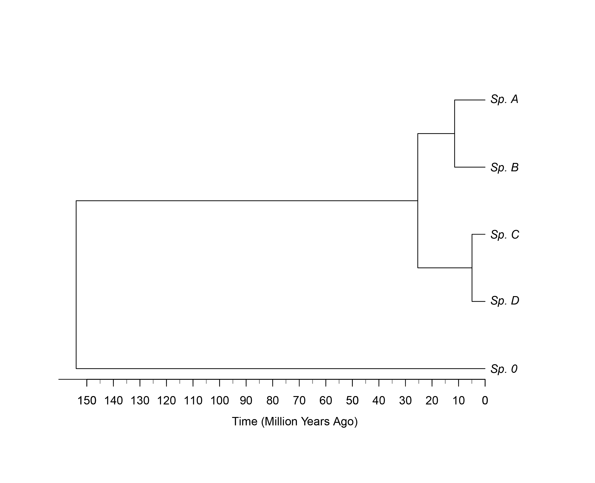

From Phylogram to Timetree: A Practical Guide to Phylogenetic
Time-Calibration in R
================

- [Requirements](#requirements)
- [Step 1: Load Library and Set Working Directory](###step-1-load-library-and-set-working-directory)


There are several ways of obtaining a time-calibrated tree from
molecular data. More often than not, they involve the use of
[BEAST](https://www.beast2.org/), which is arguably the most popular
approach, or similar
[programs](https://bioinformaticshome.com/db/collection/phylogenetics).
As of recently, [IQ-Tree v3](https://iqtree.github.io/doc/Dating) has
added yet another functionality to their already super-complete program
that allows users to easily obtain a time-estimated phylogeny in one go
from a multi-sequence alignment. However, this guide will focus on a
different method using the `R` package `ape`. This guide is meant to
illustrate one of the multiple ways a time-calibrated tree may be
obtained and is beginner-friendly.

Here, we will write a simple `R` script to perform a time-calibration
analysis on a phylogenetic tree. The script will take a Newick tree
file, re-root it using a specified outgroup, set multiple node age
constraints based on known data (e.g., fossils, geological events), and
generate an ultrametric timetree.

The final outputs will be the calibrated tree in Newick and Nexus
formats, and a high-quality PDF plot of the timetree with a geological
time axis in millions of years.

# Requirements

- `R` (\>=3.2.0) and `RStudio` installed.
- A phylogram (phylogenetic tree) in Newick format

The script relies on the
[`ape`](https://cran.r-project.org/web/packages/ape/ape.pdf) package, a
core package for phylogenetic analysis in R. You can install it by
running this command in your R console:

``` r
install.packages("ape")
```

### Step 1: Load Library and Set Working Directory

First, we load the `ape` library, which contains all the necessary
functions.

``` r
library(ape)
```

It’s best practice to use an RStudio Project to manage your working
directory. If not, you can set it manually here.

``` r
setwd("path/to/your/working_directory")
```

### Step 2: Load and Re-root the Phylogenetic Tree

Let’s say we have a tree like the one portrayed below:

<div class="figure" style="text-align: center">


<p class="caption">
*Fig. 1.* Phylogram depicting a complex of four species (Spp. A-D) and
their outgroup, Sp. 0
</p>

</div>

The script reads the tree from a Newick file (*1*). We will then define
the `outgroup_species` variable that will store the species we consider
to be the *outgroup* within a vector (*2*). And subsequently root the
tree using said outgroup (*3*).

``` r
#### 1. Read the Newick tree file #####
my_tree <- read.tree("your_newick.treefile")

#### 2. Define all your outgroup species ####
# Create a character vector with all the species names that form your outgroup.

outgroup_species <- c("Sp_0") ### If there were more outgroup species, you should add them like this -> c("Sp_0", "Sp_X", ...)

#### 3. Root the tree with the multi-species outgroup ####
# This finds the common ancestor of all species in 'outgroup_species' and roots the tree there.

my_tree <- root(my_tree, outgroup = outgroup_species, resolve.root = TRUE)

# (Optional) You can still define your ingroup this way, which can be useful for later steps
ingroup_species <- my_tree$tip.label[!my_tree$tip.label %in% outgroup_species]}
```

### Step 3: Define Calibration Points and Age Constraints

This is the core of the calibration setup. For this guide’s fairly
simple tree, we will use the following calibration point:

<div class="figure" style="text-align: center">


<p class="caption">
**Fig. 2.** Calibration points for this example
</p>

</div>

Here, We define which nodes (*4-6*) in the tree we have age information
for.

- `getMRCA()`: This function finds the node number of the **M**ost
  **R**ecent **C**ommon **A**ncestor for the given tips.
- `age.min` & `age.max`: These vectors store the minimum and maximum age
  estimates for each corresponding node, forming the bounds of the
  calibration.
- `soft.bound`: A list of values, either `FALSE` or `TRUE` that will
  tell the calibration function later on to treat this age constraints
  as strict “hard” boundaries.

``` r
#### 4. Define the root node for calibration ####
# In a rooted 'phylo' object, the root node number is always Ntip + 1.

root_node_number <- length(my_tree$tip.label) + 1

#### 5. Define a vector containing the nodes you wish to date (not in a romantic way). A.k.a. the Most Recent Common Ancestors ####
node <- c(
  root_node_number, ### MRCA between ingroup_species and outgroup_species
  getMRCA(my_tree, tip = c("Sp_A","Sp_B")), ### MRCA of Sp_A & Sp_B
  getMRCA(my_tree, tip = c("Sp_C","Sp_D")), ### MRCA of Sp_C & Sp_D
  getMRCA(my_tree, tip = c("Sp_A","Sp_B","Sp_C","Sp_D")) ### MRCA of all ingroup_species
)

#### 6. Define the maximum and minimum age estimates for the nodes established in 5. ####
# In these variables we will define vectors containing the max-min age estimates, following the order established in 5. 

# Define minimum ages in millions of years (Mya)
age.min <- c(
  130,
  6.3,
  4.25,
  23
)


# Define maximum ages in Mya
age.max <- c(
  160,
  13.3,
  8.87,
  36.5
)

# Define typology of age constraints Soft (TRUE) vs Hard (FALSE) calibrations 
soft.bound <- c(
  FALSE,
  FALSE,
  FALSE,
  FALSE
)  
```

Lastly, we will take this four separate lists and group them all in a
single table. We do this because `chronos`, which is the function within
`ape` that will allow us to calibrate the tree, cannot take separate
lists.

``` r
#### 7. We create a table containing all calibration information ####
mycalibration <- data.frame(node,age.min,age.max,soft.bound)
```

### Step 4: Perform Time-Calibration with `chronos`

The `chronos()` function takes the original tree and the calibration
data frame and estimates branch lengths in units of time, creating an
ultrametric timetree.

``` r
#### 8. We calibrate the tree using `chronos` #####
mytimetree <- chronos(my_tree, lambda = 1, model = "relaxed", calibration = mycalibration, control = chronos.control())
```

Here is a breakdown of the arguments given to `chronos`:

- `my_tree`: This is your input phylogenetic tree object ( `my_tree` in
  *3*). Its branch lengths are currently in units of substitutions per
  site (genetic distance).

- `lambda = 1`: This is a “smoothing” parameter. A lambda of 1 is a
  standard value that heavily penalizes rapid changes in evolutionary
  rates between ancestral and descendant branches. In essence, it tries
  to keep the rates of evolution somewhat consistent across the tree,
  which is a common assumption in these models.

- `model = "relaxed"`: This is a crucial choice. It tells `chronos` what
  kind of “molecular clock” to use.

  - A **“strict” clock** would assume every single branch in the tree
    evolves at the exact same speed. This is rarely true in reality.
  - A **“relaxed” clock** (which you are using) allows different
    lineages to have different rates of evolution. It assumes that the
    rate on a descendant branch is related to the rate on its parent
    branch but can vary. This is a much more realistic model for most
    datasets.

- `calibration = mycalibration`: This is where you’re telling `chronos`
  the nodes you have specified in this table *must* end up within the
  age ranges you have provided.

- `control = chronos.control()`: This uses the default settings for the
  numerical optimization algorithm that `chronos` runs in the background
  to find the best possible set of branch lengths that fit both the
  original data and your calibration constraints.

### Step 5: Save the Calibrated Tree

The resulting timetree object is saved in both Newick (`.tree`) and
Nexus (`.nex`) formats for use in other phylogenetic software (like
FigTree).

``` r
#### 9. Save the calibrated tree in Nexus and Newick formats ####
write.tree(mytimetree, file="your_calibrated_tree.tree")     # Newick format
write.tree(mytimetree, file="your_calibrated_tree.nex")      # Nexus format
```

### Step 6: Plot and Save the Timetree

Finally, the script generates a plot of the timetree and saves it as a
PDF. It includes custom code to draw a properly scaled time axis at the
bottom, labeled in “Million Years Ago.”

``` r
#### 10. Save the timetree in pdf format with time axis.

pdf("your_calibrated_tree.pdf", width = 8, height = 6) 
plot(mytimetree)

axisPhylo(side = 1,          # Place axis at the bottom (1 = X-axis)
          backward = TRUE,   # Present (0) on the right, past on the left
          las = 1,           # Horizontal axis labels
          col = "black")     # Axis color

# Add custom ticks (e.g., every 5 Mya)
root_age <- max(node.depth.edgelength(mytimetree))
custom_ticks <- seq(0, root_age, by = 5)  # Change '10' to '5' for ticks every 5 Mya

# Add minor ticks (no labels)
axis(1, at = root_age - custom_ticks, labels = FALSE, tcl = -0.3, col.ticks = "gray50")

# Add labeled major ticks (every 20 Mya, optional)
major_ticks <- seq(0, root_age, by = 10)
axis(1, at = root_age - major_ticks, labels = major_ticks, las = 1, col = "black")


# Add axis label
mtext("Time (Million Years Ago)", 
      side = 1,              # Below the plot (X-axis)
      line = 2.5,            # Adjust position
      cex = 1)               # Label size
dev.off()
```

And the resulting tree should look something like this:

<div class="figure" style="text-align: center">


<p class="caption">
**Fig. 3.** Calibrated timetree after following this guide
</p>

</div>
